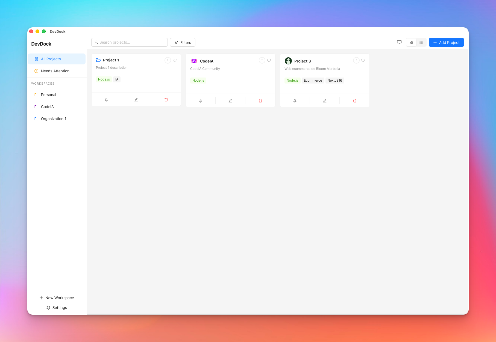
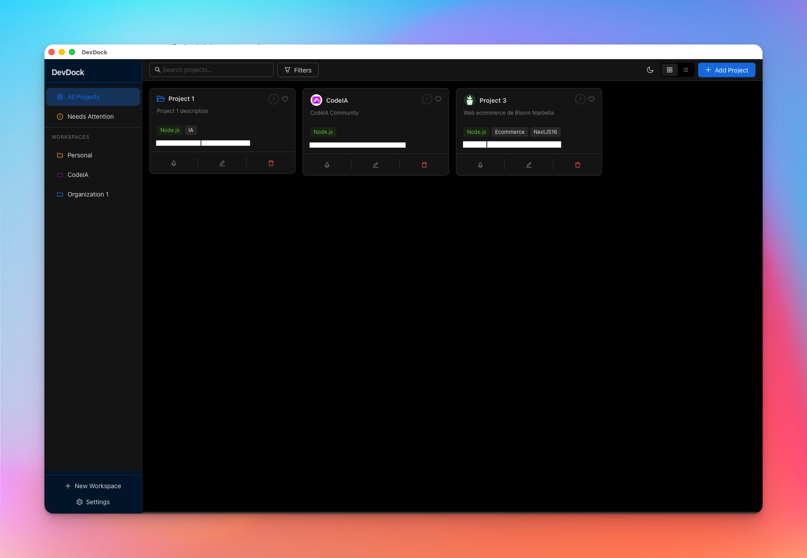

# DevDock

A developer project launcher built with Tauri v2 + React + TypeScript. Organize, open, and manage your local projects from a single desktop app.

  

## Screenshots

| Light Mode | Dark Mode |
|-----------|----------|
|  |  |

## Features

- **Project Management** — Add local projects with auto-detection of tech stack (Node.js, Rust, Python, Go, Java, Swift, PHP, Ruby, .NET)
- **Workspaces** — Group projects into color-coded workspaces
- **IDE Integration** — Launch projects directly in your preferred IDE (VS Code, Cursor, WebStorm, etc.)
- **Avatars** — Custom images for projects and workspaces
- **Structured Notes** — Rich note editor per project
- **GitHub Integration** — Link repos, view recent commits, push/pull actions with token-based auth
- **Search** — Fuzzy search across all projects
- **Dark / Light / Auto theme** — Follows system preference or manual override
- **Health Score** — At-a-glance project health based on git activity and metadata completeness
- **Auto-updater** — Built-in update mechanism

## Tech Stack

| Layer | Technology |
|-------|-----------|
| Desktop shell | [Tauri v2](https://tauri.app) (Rust) |
| Frontend | React 18 + TypeScript + Vite |
| UI components | Ant Design 5 |
| State / data | TanStack Query v5 + Zustand |
| Database | SQLite via SQLx |
| Git | libgit2 (git2-rs) |
| Secrets | OS Keychain (keyring) |

## Requirements

- [Rust](https://www.rust-lang.org/tools/install) (stable)
- [Node.js](https://nodejs.org) 18+
- [Tauri CLI prerequisites](https://tauri.app/start/prerequisites/) for your OS

## Development

```bash
# Install dependencies
cd devdock
npm install

# Start dev server (Tauri + Vite)
npm run tauri dev
```

## Build

```bash
npm run tauri build
```

Produces platform-specific installers in `src-tauri/target/release/bundle/`.

## Project Structure

```
devdock/
├── src/                    # React frontend
│   ├── components/         # UI components (projects, workspaces, settings…)
│   ├── hooks/              # Custom React hooks
│   ├── queries/            # TanStack Query hooks
│   ├── services/           # Tauri command wrappers + utilities
│   ├── stores/             # Zustand global state
│   └── types/              # TypeScript type definitions
├── src-tauri/              # Rust backend
│   ├── src/
│   │   ├── commands/       # Tauri command handlers
│   │   └── db/             # SQLite migrations and pool setup
│   ├── capabilities/       # Tauri permission definitions
│   └── tauri.conf.json     # App configuration
```

## License

MIT
